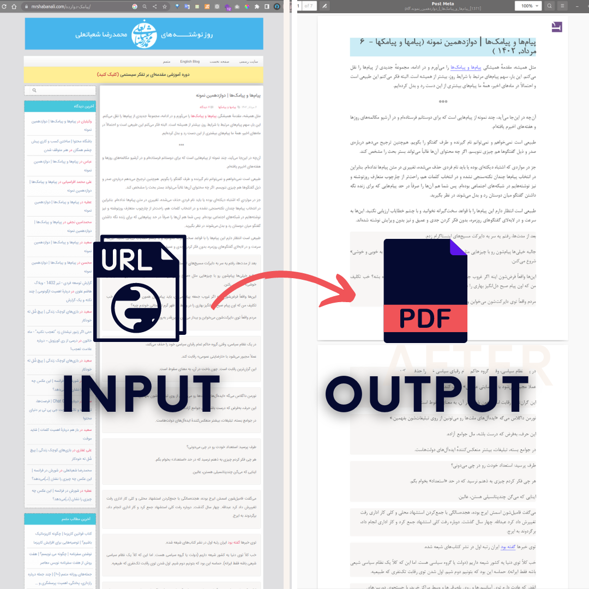

# scapper_for_mrshabanali.com

<div style="margin-bottom: 20px;">
    <a href="https://mrshabanali.com">
        
    </a>
</div>
<br>
This project contains a collection of Python scripts for scraping data from the <a href=mrshabanali.com>mrshabanali.com</a>. The script crawls the website, extracts each post's data, and finally stores it in PDF format for you.

# Table Of Content
- [Features](#features)
- [Requirements](#requirements)
- [Configuration](#configuration)
- [Usage](#usage)
    - [Scrape Post Links](-scrape-post-links)
    - [Scrape Post Data](#scrape-post-data)
- [Logging](#logging)
- [HTML code template content](#html-code-template-content)

  
# Features
- **Efficient Web Scraping**: The LinkCrawler and DataCrawler classes utilize optimal web scraping techniques, including rate limiting and graceful handling of HTTP errors, to ensure efficient and reliable crawling. You can use LinkCrawler to find all links related to posts and store them in a `.json` file within a directory. Similarly, the DataCrawler can be employed to save all post contents as `.pdf` files.
- **Metadata Extraction**: The DataCrawler extracts relevant metadata such as post titles, release dates, and categories, providing essential context for each post.

  
  <div style="margin-bottom: 20px;">
        
    </a>
</div>
<br>

# Requirements
Ensure you have the required libraries installed by running the following command:
```bash
pip install -r requirements.txt
```

**Note**:To convert HTML to PDF, download and install PrinceXML from the official website for your operating system.

# Configuration
Before running the scripts, you need to configure the config.py file to match your settings:
- `BASE_LINK`: Set the first-page address of the site.
- `STORE_PATH`: Set the storing path for saving URLs' JSON file.
- `HTML_OUTPUT_CODES`: Set the storing path for generated HTML codes for each URL.
- `PDF_DIR`: Set the storing path to save PDF files for each URL.

# Usage
<div style="margin-bottom: 20px;">
    <a href="https://mrshabanali.com">
        
    </a>
</div>
<br>

## **Scrape Post Links**
To start the LinkCrawler and scrape post links, use the following command:
```bash
python main.py scrape_posts_links
```
This command will initiate the `LinkCrawler` to efficiently crawl the website and extract post links. The scraped post links will be stored in a JSON file within the `Scraped_urls` directory.(by default.). The output on the terminal would be as follows:
  <div style="margin-bottom: 20px;">
        
    </a>
</div>
<br>

## **Scrape Post Data** 
To start the DataCrawler and scrape post data, use the following command:
```bash
python main.py scrape_posts_data
```
This command will initiate the DataCrawler to efficiently crawl the website, download post content and metadata, and generate PDF files for each post's content. The generated PDF files will be saved in the 'Output_PDFs' directory. There is a `.html`(Which is named as `template_html_code.html`) template file, Scrapper exports content to this `.html` file and then it will  convert it to pdf. The output on the terminal would be as follows:
  <div style="margin-bottom: 20px;">
        
    </a>
</div>
<br>


**Note**:Both commands can be used separately depending on your needs. You can run `scrape_posts_links` first to collect the post links and then run `scrape_posts_data` to download the content and generate PDFs.

# Logging
The project implements a comprehensive logging mechanism to provide insights into different aspects of the application's functionality. The logging system employs four separate loggers:

- **data_crawler_logger**: This logger records and saves logs specific to the DataCrawler class. It captures and stores information related to data crawling processes and post content extraction.

- **link_crawler_logger**: The link_crawler_logger is dedicated to the LinkCrawler class. It shows and saves logs during the process of crawling and extracting post links from the website.

- **conversion_logger**: The conversion_logger is responsible for displaying and storing logs related to the conversion of .html files to .pdf files. It records any issues or successful conversions during this process.

- **change_filename_logger**: The change_filename_logger logs events related to renaming files, specifically the renaming of PDF files in the `Output_PDFs` directory. It helps track any issues or changes made to file names.

The logging mechanism ensures that critical events and potential errors are recorded for easy identification and debugging. Logs can be accessed and reviewed for monitoring and troubleshooting purposes, offering valuable insights into the application's execution flow. By effectively leveraging logging throughout the project, you can gain better visibility into its behavior and performance, facilitating a smoother development and maintenance experience.


Each logger saves its respective logs to separate log files. Here's a breakdown of the log files:

- data_crawling_logs.txt: Contains logs specific to the DataCrawler class.
- link_crawling_logs.txt: Contains logs specific to the LinkCrawler class.
- conversion_logs.txt: Stores logs related to the conversion of .html files to .pdf files.
- change_filename_logs.txt: Contains logs for file renaming operations.
All these logs will be saved in `Logs` directory as follows:


  <div style="margin-bottom: 20px;">
        
    </a>
</div>
<br>

# html code template content:
The `template_html_code.html` code is as follows:

```html 
<!DOCTYPE html>

<html lang="fa">
    <head>
        <meta charset="UTF-8"> 
        <meta name="viewport" content="width=device-width, initial-scale=1.0"> 
        <title>Post Meta</title> 
        <style>
            @font-face {
            font-family: "CustomFont"; /* Choose a name for your font */
            src: url("./fonts/B-NAZANIN.TTF") format("truetype"); /* Adjust the path and format to match your font file */
            }

            body {
                font-family: "CustomFont", sans-serif;
                font-size: 14pt;
                line-height: 0.8cm;
                margin-left: 5%;
                margin-right: 5%;
                background-color:white;
                direction: rtl;
                
            }
            img{
                align-items: center;
                align-self: center;
            }
        


        </style>

    </head>
        
    <body>
        <div style="text-align: right; background-color: rgb(183, 229, 242); ">
            <h1 dir="rtl" >
                %%{title}%% (%%{category}%% - %%{date}%%)
            </h1>
        </div>

            %%{content}%%
    </body>

    </html>
    
        
```
